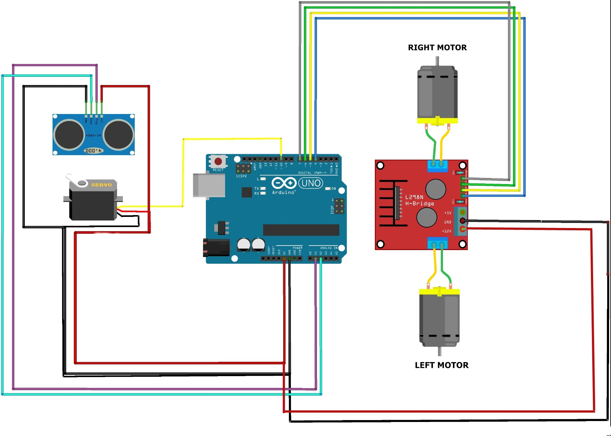
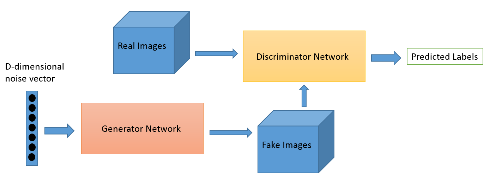

# pmp
Proiectare cu microprocesoare

## Robot care ocoleste obstacole

1. Schema
   
2. Utilizare
   - Se ruleaza codul in Arduino si se urca pe placuta. Mai departe robotul ruleaza independent.
3. Componente
   - Placa Arduino uno
   - Senzor ultrasonic
   - Servo
   - Doua motoare
   - H-bridge
4. Explicatii

   - Senzorul ultrasonic trimite un semnal, care este controlat de trigPin. Acesta asteapta pana cand unda se intoarce, iar senzorul returneaza timpul intre momentul in care s-a trimis semnalul si momentul in care a receptionat intoarcerea semnalului. Stiind viteza cu care este propagata unda (viteza sunetului) si timpul, se poate calcula distanta parcursa.
   - distanta = viteza * timp
	- In functie de distanta la care se afla obiectul in fata robotului acesta poate sa: mearga in fata, vireze la dreapta, vireze la stanga.

## GAN (generative adversarial network)

1. Schema
   
   - generatorul inceraca sa genereze imagini astfel incat sa pacaleasca discriminatorul. Ia ca si input un random noise si genereaza un array bidimensional de valori, adica o imagine random
   - discriminatorul primeste ca input falsuri (de la generator) si poze reale. El are ca output o valuare intre 0 si 1 care semnifica probabilitatea ca poza sa fie un fals. 
   - dupa ce generatorul a determinat probabilitatea, pe baza acesteia se porneste procesul de recalculare a weightu-urilor (backpropagation)
   - In cazul in care se foloseste modelul deja antrenat, trebuie rulata doar ultima parte (train(train_dataset, EPOCHS)).
Daca se doreste reantrenarea mdelului pe alt set de date, acesta trebuie urcat intai in google drive. Modelul este antrenat in drive folosing platforma Google CoLab. Se ruleaza sectiunea 5 si 6, care scaleaza pozele si salveaza un fisier binar cu toate. Procesul acesta poate dura pana la 5 ore, in functie de dimensiunea setului de date. Fiind vorba de o retea neuronala, nu are sens sa se foloseasca seturi de date mici.
